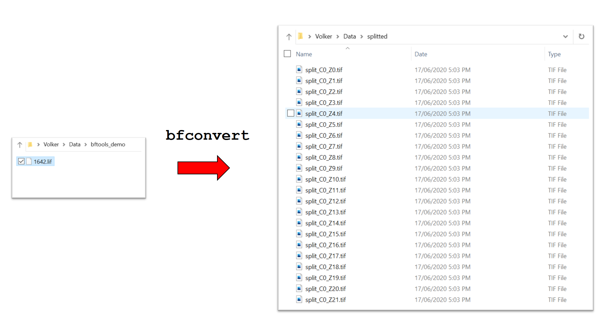

# How to split, convert and rename microscopy images using `bfconvert`



## Aim / Audience

### Format conversion, splitting and renaming
A common task in Bioimage Analysis is converting the images from the microscope from the particular format of the microscope manufacturer to a format that can be processed by the software tools used in a batch image analysis workflow. The [Bioformats/OME project](https://www.openmicroscopy.org/bio-formats/) has developed the most comprehensive open-source software package for reading  the plethora of different proprietary microscopy image formats. To many users this will be familiar as a way to read microscope images into ImageJ/Fiji and other packages. 

Often, rather than just reading an image and resaving it in a different format, it also makes sense to split the images into smaller parts, for example one might want to split a single file that contains images from a multiple-position scan into multiple individual files, where each file contains only images from a single position. Similarly, one may want to split images between different channels, time points or Z-slices. To keep track of the particular position (e.g. the well of a multiwell plate) or time point/channel/Z-slice that an image came frome in the subsequent batch analysis workflow, it can be useful to embed such meta-data in the filename. 

Even for batch analysis software that has Bioformats built-in ([CellProfiler](http://cellprofiler.org) is a prominent example), the approach of splitting, converting (in particular to `.tif`) and renaming can have some benefits:

* it allows for standardization in an image analysis workflow even in a hetergoneous facility environment with many different microscopes. By using the extra step of renaming/conversion, one can use the same pipeline/workflow for images originating from different microscope systems;
* dealing with single large files often has performance penalties, handling smaller files can be more efficient;
* analysing or sharing a subset of the data is more easily done on a collection of files (this can simply be done in any file manager) rather than with a single file which can exceed hundreds of Gigabytes for a 96-well time lapse experiment.

Research labs who adopt such an approach often have their own scripts or macros to do this. However, in many cases  `bfconvert` from the [Bioformats command line tools](https://docs.openmicroscopy.org/bio-formats/latest/users/comlinetools/index.html) can handle this task such that no custom scripts are needed.

### Alternatives

Using a database such as Omero is an alternative (and arguably "better") approach to standardizing input files from heterogenous microscopes. However, in particular for smaller labs/facilities, introducing a database systems also comes with challenges (administration, user training).

### Audience

This document should serve as a short overview of how to install the Bioformats commandline tools and how to use `bfconvert` to split and convert imagess for facility users who have little experience of working with the command line.


## A quick example:

Here is a short interactive session using Window's `cmd.exe`:


What happens here:

1. we see the prompt idicating the current working directory;
1. we create a new folder `splitted` in the already existing subfolder `Data` using the `mkdir` command;
1. we change the working directory to the subfolder `bftools`. this is where we unpacked our `bftools.zip` download.
1. we call `bfconvert` and specify that our input file is `..\Data\bftools_demo\1642.lif` (first argument) and that the output should be series of tif files in the folder `Data\splitted` with the filenames starting with `split` followed by channel and Z-slice numbers (second argument)
1. bfconvert then starts processing this large `.lif` file and we end up with many individual files (see illustration at the top of this page)


## Download and installation

Download the latest version of the Bioformats command line tools [here](https://downloads.openmicroscopy.org/bio-formats/latest/artifacts/bftools.zip) and extract the `.zip`-Archive.

The tools are _portable_, i.e. you can run them from the directory you unzip them to and they don't need an installer.


## Command line basics

If you have never worked with the command line, have a look at [command line basics](./terminal_basics.md) first.

## `bfconvert` common use case.

Most commonly you want to use `bfconvert` in the following way:

```
bfconvert inputfile  outputfilepattern
```

or

```
bfconvert -padded inputfile  outputfilepattern
```

where `inputfile` is the path to the input file and `outputfilepattern` specifies the output file path and format string.
See below for an explanation of the `-padded` option.

There are a plethora of additional options that are beyond the scope of this beginners tutorial. You can see them by typing
```
bfconvert --help
```

## Format string

The `outputfilepattern` is not a single filename but rather a format string that defines a filename template.
After all we want to split a single file into many files, so we need to specify how the many files are named.
`bfconvert` replaces parts of the format string with the index number or name of the particular
subset of the input file that is written to a given output file, according to the following pattern:

```
   Pattern:     Metadata value:
   ---------------------------
   %s           series index
   %n           series name
   %c           channel index
   %w           channel name
   %z           Z index
   %t           T index
   %A           acquisition timestamp
   %x           row index of the tile
   %y           column index of the tile
   %m           overall tile index
```

For a given file format you may have to try out first what `series` and other metadata fields correspond to. In my experience, for `.lif` files (Leica) the different series indices correspond to different positions of a multiposition scan. 
In some cases, it can also happen that certain indices are swapped. 

## zero-padding of numbers 

You almost always want to pass the `-padded` option to bfconvert. This makes sure that all numbers in the filename will have the same number of digits, e.g. `1` will be converted to `001` if there are more than 100 images in the series. This greatly helps with sorting files in Windows explorer, Mac Finder and other tools which typically use alphabetical (rather than natural) sorting. 

## Do I use `%` or `%%` ?

### Windows
There is peculiarity when passing the format string to bfconvert on Windows. The windows command interpreter treats `%` as a special character to denote variables. So the interpreter will not pass on the `%` in your format string to bfconvert. You need to explicitly tell the command interpreter that you want to pass on the `%` literally by preceeding it with an additional `%`, thus each of the patterns above must start with a `%%` in `cmd.exe`

### Unix (Mac/Linux)
The default shell will pass the `%` literally to bfconvert, you don't need to prepend anything

## Whitespace in file and folder names

When working on the command line, white space characters in file and folder names are an annoyance. 
If you try and pass a file name that contains spaces as an option to a command line program, the command interpreter sees several separate arguments, e.g. for a command such as

```
bfconvert My File.czi My Output File.tif
```

the first argument passed to bfconvert will be just `My` (rather than `My File.czi`)  and the last argument will be just `File.tif` (rather than `My Output File.tif`). There are several different ways to tell the command line interpreter that the white spaces are part of the file name, one possible way is simply to use quotes around each element:

```
bfconvert "My File.czi" "My Output File.tif"
```

